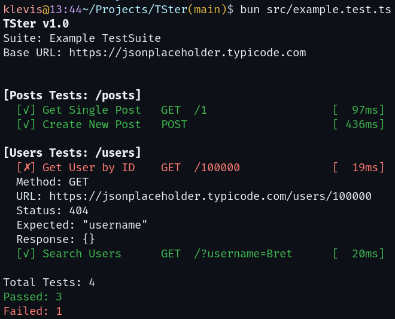

# TSter
A TypeScript simple, no-bloat REST API tester script.

#### Example
```ts
import { TSter, type TestSuite} from "./TSter";


const suite: TestSuite = {
  name: "Example TestSuite",
  url: "https://jsonplaceholder.typicode.com",
  testSets: [
    {
      name: "Posts Tests",
      url: "/posts",
      testCases: [
        {
          name: "Get Single Post",
          method: "GET",
          url: "/1",
          expected: "id"
        },
        {
          name: "Create New Post",
          method: "POST",
          expected: "id",
          headers: { "Content-Type": "application/json" },
          body: { title: "Test Post", body: "Content", userId: 1 }
        }
      ]
    },
    {
      name: "Users Tests",
      url: "/users",
      testCases: [
        {
          name: "Get User by ID",
          method: "GET",
          url: "/100000",
          expected: "username"
        },
        {
          name: "Search Users",
          method: "GET",
          url: "/?username=Bret",
          expected: "Leanne Graham"
        }
      ]
    }
  ],
};

await TSter(suite);
```
```
$ bun src/example.test.ts 
TSter v1.0
Suite: Example TestSuite
Base URL: https://jsonplaceholder.typicode.com


[Posts Tests: /posts]
  [✓] Get Single Post   GET  /1                   [  63ms]
  [✓] Create New Post   POST                      [ 387ms]

[Users Tests: /users]
  [✗] Get User by ID    GET  /100000              [  19ms]
  Method: GET
  URL: https://jsonplaceholder.typicode.com/users/100000
  Status: 404
  Expected: "username"
  Response: {}
  [✓] Search Users      GET  /?username=Bret      [  20ms]

Total Tests: 4
Passed: 3
Failed: 1
```

