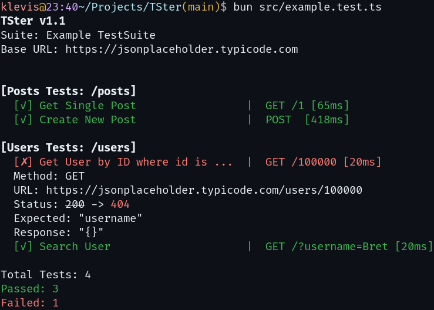

# TSter
A TypeScript simple, no-bloat REST API tester script.

#### Example
```ts
import { TSter, type TestSuite, type TestSet } from "./TSter";

const testPosts: TestSet = {
  name: "Posts Tests",
  url: "/posts",
  testCases: [{
    name: "Get Single Post",
    method: "GET",
    url: "/1",
    expected: "id"
  },{
    name: "Create New Post",
    method: "POST",
    expected: "id",
    headers: { "Content-Type": "application/json" },
    body: { title: "Test Post", body: "Content", userId: 1 }
  }]
};

const testUsers: TestSet = {
  name: "Users Tests",
  url: "/users",
  testCases: [{
    name: "Get User by ID where id is large so it should fail",
    method: "GET",
    url: "/100000",
    expected: "username"
  },{
    name: "Search User",
    method: "GET",
    url: "/?username=Bret",
    expected: "Leanne Graham"
  }]
};


const suite: TestSuite = {
  name: "Example TestSuite",
  url: "https://jsonplaceholder.typicode.com",
  testSets: [testPosts, testUsers]
};

await TSter(suite);
```
```
$ bun src/example.test.ts 
TSter v1.0
Suite: Example TestSuite
Base URL: https://jsonplaceholder.typicode.com


[Posts Tests: /posts]
  [✓] Get Single Post                 |  GET /1 [61ms]
  [✓] Create New Post                 |  POST  [454ms]

[Users Tests: /users]
  [✗] Get User by ID where id is ...  |  GET /100000 [19ms]
  Method: GET
  URL: https://jsonplaceholder.typicode.com/users/100000
  Status: 404
  Expected: "username"
  Response: {}
  [✓] Search User                     |  GET /?username=Bret [18ms]

Total Tests: 4
Passed: 3
Failed: 1
```


